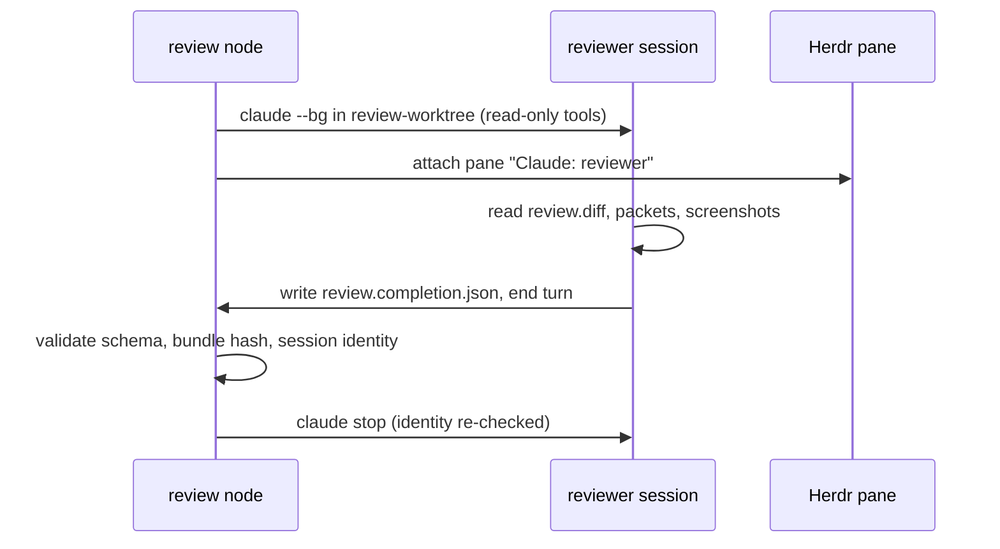

# PRD: Reviewer as an attachable native session (slice A)

Status: Implemented offline on 2026-09-21; the controlled live smoke test in section 5 has **not** been run. Handoff: [HANDOFF_REVIEWER_PANE.md](HANDOFF_REVIEWER_PANE.md). Umbrella: [PRD_REVIEW_VISIBILITY.md](PRD_REVIEW_VISIBILITY.md).

This slice is controller work plus the completion schema and docs: `workflow/`, `contracts/workflow/reviewCompletion.schema.json`, `workflow/RUNBOOK.md` and the feature README. None of it is worker-owned, so it ships as an ordinary commit with offline tests and a controlled live smoke test (section 5), and needs no feature run. Its first live exercise inside a full run is the review step of the next feature run (slice B).

## 1. Goal

The reviewer runs as a native Claude session with the same session interaction and lifecycle as a worker, with restricted reviewer tools: a Herdr pane the operator can type into, a completion-file protocol, the same automatic wait, and a transcript that is resumable afterwards like a worker's. Its tools stay read-only (Read, Glob, Grep).

Success: on the next automatic run, a third pane labelled `Claude: reviewer` appears in the run's tab when the review node starts, the operator can answer a question the reviewer asks, and the run still completes unattended when nobody types.

## 2. Confirmed decisions

- Same session interaction and lifecycle as workers (pane, human input, completion protocol, automatic wait, resumable transcript), with restricted reviewer tools.
- One review per bundle. A blocked verdict ends the run; fixing findings means a new run with a new bundle.
- Print mode stays available behind `--reviewer-transport print` for environments without Herdr. Default is the native session.

## 3. Design

The review node launches `claude --bg --name workflow-<run>-reviewer` in `review-worktree/` with tools Read, Glob and Grep, no MCP servers, the run directory added as a readable path, and permission mode `dontAsk`. `attach_panels` and `attach-one` gain a third pane, reusing `settle()` for the late pid and `require_shell()` for the pane's shell.

| Item | Value |
| --- | --- |
| Completion file | `<run>/review.completion.json` |
| Bound to | run id, `review` node, bundle SHA-256, candidate commit, reviewer session UUID |
| Payload | verdict `approved` or `blocked`, findings `[{severity, message, disposition, worker, requirement}]` |
| Accepted when | file validates against the schema and the native session is `idle` or `done` |
| Timeout | `review_timeout_seconds` from launch of the reviewer session, default 30 minutes |
| Independence | reviewer UUID must differ from both worker UUIDs; verified from `claude agents --json` |
| Human input | allowed in the pane, as for workers; the transcript is the record; the verdict is only the file |
| After acceptance | `claude stop` with identity re-checked; transcript stays resumable |

The finding fields `worker` (`ui`, `adapter`, `both`, `none`) and `requirement` (a verbatim quote from the task text, or null) are requested in the reviewer prompt now so that slice C can link findings to tasks without changing the protocol again.

## 4. Work items

1. `contracts/workflow/reviewCompletion.schema.json`: the completion-file schema, shared with the reviewer prompt. Findings carry `worker` and `requirement`.
2. `automatic.py`: replace `review_candidate`'s print-mode call with the native launch, a `wait_review` poll mirroring `wait_handoffs`, schema validation of the completion file, the existing bundle and identity re-checks, and a confirmed stop. Keep print mode behind `--reviewer-transport print`.
3. `interactive.py`: third pane in `attach_panels` and `attach-one`.
4. `pipeline.py`: the review node writes a `review.interactive.json` receipt with the reviewer session UUID and records it in an event.
5. Tests: offline reviewer through `FakeSessions`; the three-process recovery test extended to a reviewer interruption that leaves the reviewer running; a rejected completion file (wrong bundle hash, wrong UUID, wrong candidate) fails closed; print-mode fallback still passes the existing tests.
6. Docs: RUNBOOK and feature README describe the third pane, the completion protocol and the resume path for the reviewer transcript.

## 5. Acceptance

Offline tests (work item 5) gate the commit. Before merging, run one controlled live smoke test: a scratch run directory holding a copy of project-workflows-001's `review-bundle.json`, `review.diff` and verification packets, with the review node driven on its own so the reviewer session launches in a `review-worktree/` at the candidate commit, a pane appears, a completion file is written and the session is stopped. Nothing is integrated and the real run directory is untouched. This catches the launch-time failures (late pid, pane not ready) that the first live run showed offline tests do not.

- The reviewer session appears in `claude agents --json` under the run's reviewer name with a UUID different from both workers, and a third pane exists in the run's tab.
- A reviewer that stops to ask a question can be answered in the pane, and the run resumes when the completion file appears and the session goes idle.
- Interrupting the supervisor during the review leaves the reviewer running and `automatic --live` resumes it.
- A reviewer that ends its turn without a file idles until `review_timeout_seconds`, then the run stops with evidence retained. No second reviewer is launched.

## 6. Open questions

- [x] Three-pane layout: the reviewer pane is created in the same tab when the review node starts. Because the session does not exist at `start`, this is `attach_reviewer_pane`, called by the review node, rather than a third pane in `attach_panels`.
- [ ] Whether to fail earlier than the timeout when the reviewer is idle without a file for ten minutes. Same question exists for workers; decide once for both.

## 7. Implementation note

The reviewer's tool set is `Read, Glob, Grep, Write`. A reviewer with no write tool cannot produce the completion file this slice defines, so the read-only intent is enforced by everything else instead: no Bash, no agents, no MCP servers, and a verdict is accepted only while the reviewer's worktree is still the clean candidate commit and the bundle and diff hashes are unchanged.
